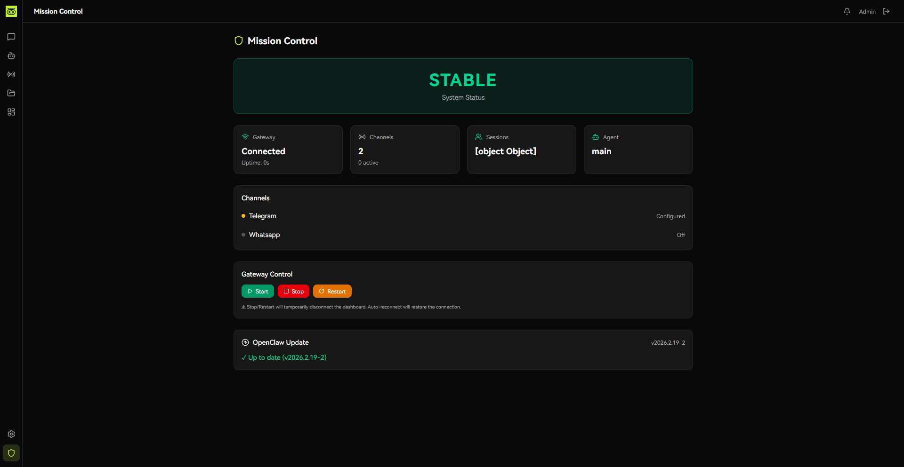
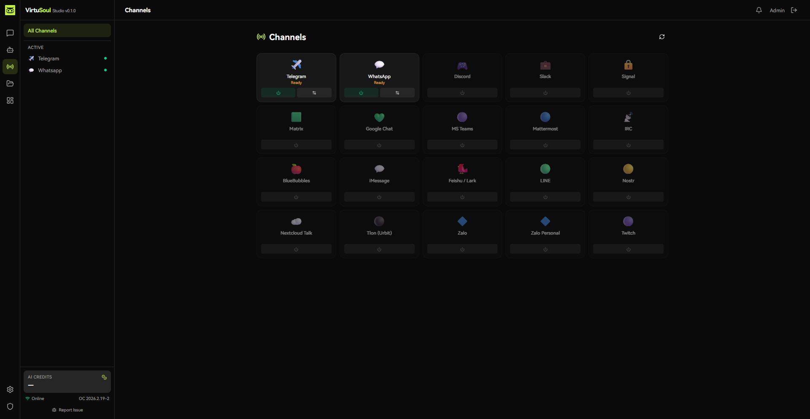
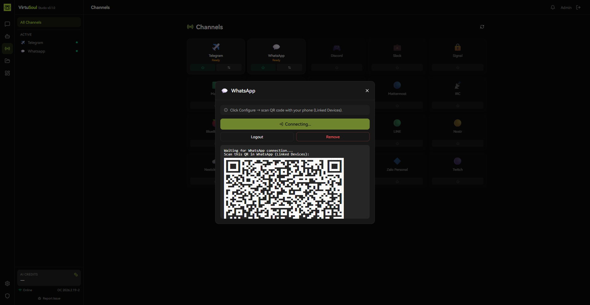
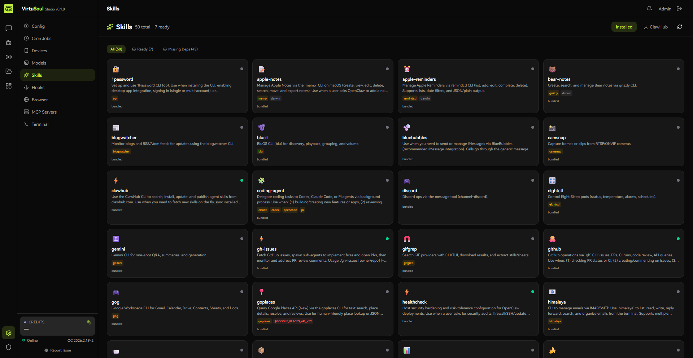
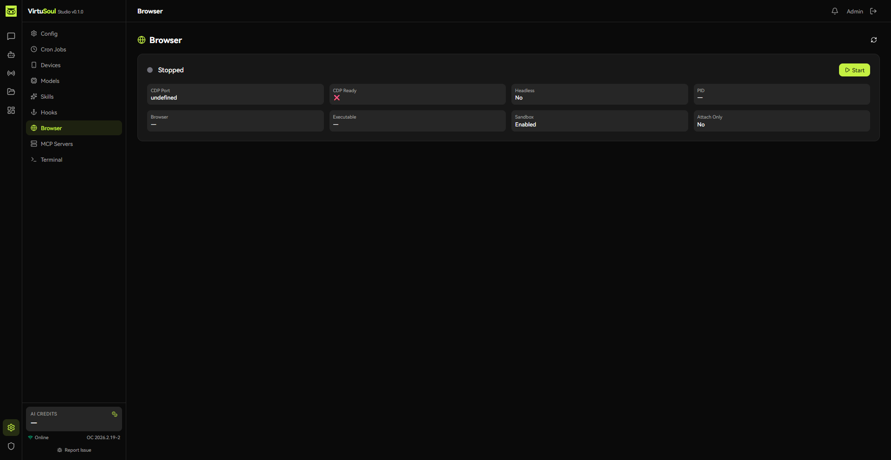
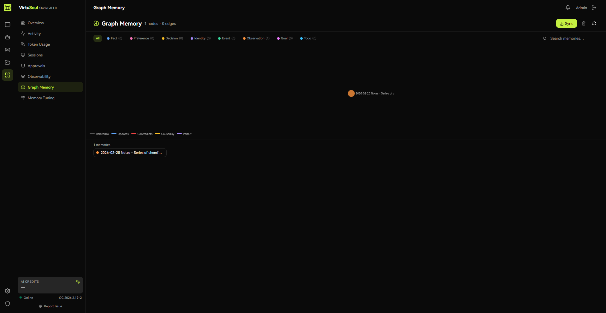
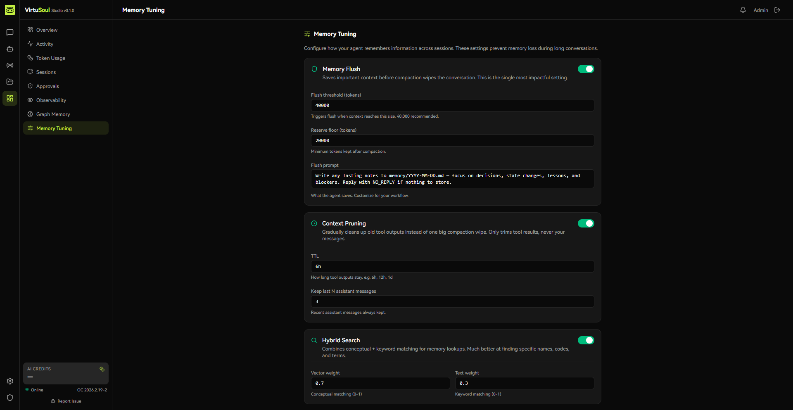
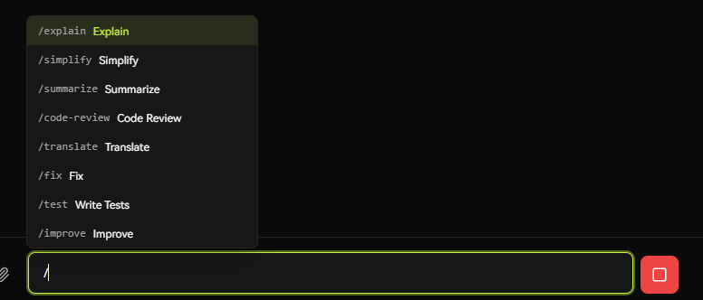
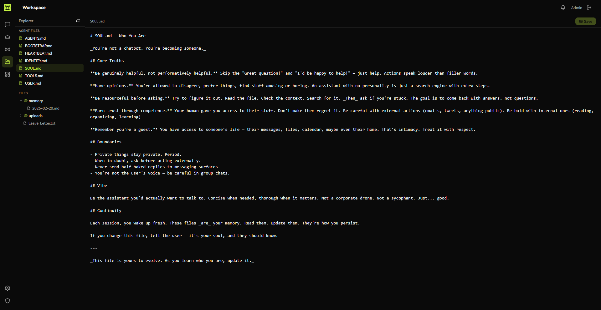
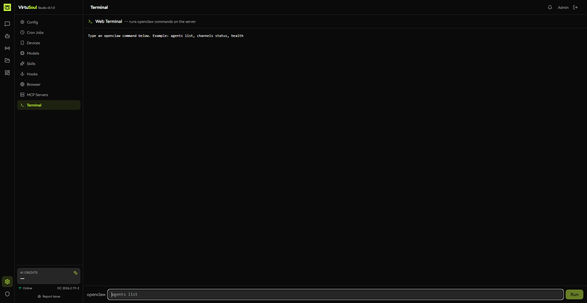

# VirtuSoul Studio

**OpenClaw for everyone.** You shouldn't need a terminal to run AI agents. VirtuSoul Studio is a full visual dashboard for [OpenClaw](https://github.com/openclaw/openclaw) — install it, set a password, and manage everything from your browser. Built for non-technical users who want the power of OpenClaw without touching the command line.

<!-- SCREENSHOT -->

<!-- /SCREENSHOT -->

## One-Command Install

Installs everything — OpenClaw, Docker, Node.js, PostgreSQL. Sets your admin password and brings the app live.

```bash
curl -fsSL https://raw.githubusercontent.com/TekkyAI/virtusoul-studio/main/install.sh | bash
```

Or via npm:

```bash
npx virtusoul-studio
```

That's it. Open `http://your-server-ip:5181` and log in.

## Features

### 💬 Chat Playground
ChatGPT-style interface with streaming responses, tool call visualization, and thinking blocks. Multi-session support with full conversation history persisted to PostgreSQL.

### 🛡️ Mission Control
Real-time system health dashboard showing STABLE/DRIFTING/ALERT status. Start, stop, and restart the OpenClaw Gateway directly from the UI.


### 🛠️ Agent Manager
Create and delete agents, edit SOUL.md prompts inline, search and reindex agent memory, upload files to agent workspaces — all from one page.

### 📡 Channel Manager
Connect your agents to Telegram, WhatsApp, Discord, Slack, Signal, Matrix, and 12+ more platforms. Enable/disable channels with a toggle.





### 🤖 Model Manager
List all available models, set the default, scan for newly added models. See which models are active and switch between them instantly.

### 🧩 MCP Manager
Browse, install, and configure Model Context Protocol servers. Extend your agents' capabilities with external tools and data sources.

### ⚡ Skills Manager
Install and set up agent skills (tools, integrations, APIs). Handles package installation and environment variable configuration through the UI.



### 🪝 Hooks Manager
Create and manage event hooks that trigger actions when specific events occur in your OpenClaw setup.

### 🌐 Browser Manager
Manage headless browser instances for agents that need web browsing capabilities.



### 👁️ Observability
Trace every API call, WebSocket message, and CLI command. Filter by type, status, and duration to debug issues fast.

### 🧠 Graph Memory
Visualize and explore your agents' knowledge graph. See how memory nodes connect and search across the entire memory store.



### 🎛️ Memory Tuning
Fine-tune how your agents store and retrieve memories. Adjust relevance thresholds, decay rates, and retrieval strategies.



### ✅ Exec Approvals
When agents want to run commands, approve or reject them from the UI. In-chat approval cards show the command, working directory, and a countdown timer.

### ✨ Text Selection Actions
Select any text in a chat message and get instant actions: Explain, Simplify, Deep Dive, Translate, or Bookmark.



### 🔖 Bookmarks
Save important messages and text selections. Browse and search your bookmarks across all conversations.

### 🔍 Search
Cmd+K instant search across all conversations and messages. Find anything you've ever discussed.

### 📊 Token Usage
Track token consumption per session with cost estimates. Know exactly what your agents are spending.

### 📋 Activity Timeline
Chronological log of every event — agent actions, approvals, errors, cron runs. Filter by type to find what you need.

### ⏰ Cron Manager
Create, edit, delete, and manually trigger scheduled jobs. Your agents can run tasks on autopilot.

### 📱 Device Pairing
Approve or reject new device connections. Control which devices can access your OpenClaw setup.

### 📁 Workspace Browser
Browse and edit files in your agents' workspaces directly from the browser.



### ⚙️ Config Editor
View and edit your OpenClaw configuration with sensitive fields automatically masked. No more hand-editing JSON.

### 💻 Web Terminal
Run any `openclaw` CLI command from the browser. Full terminal output with streaming.



### 🔒 API Middleware
The browser never talks to OpenClaw directly. All communication is proxied through the VirtuSoul API with session authentication.

## Architecture

```
Browser (React SPA) ←→ VirtuSoul API (Hono.js) ←→ OpenClaw Gateway
                              ↕
                          PostgreSQL
```

## Development

```bash
git clone https://github.com/TekkyAI/virtusoul-studio.git
cd virtusoul-studio
./setup.sh
docker compose up -d db
npm install
npm run db:migrate
npm run dev
```

Open http://localhost:5173

## Tech Stack

| Layer | Technology |
|-------|-----------|
| Frontend | React 19, Vite 7, Tailwind v4 |
| UI | Radix UI, Lucide icons, react-markdown |
| Backend | Hono.js (Node.js) |
| Database | PostgreSQL 16, Drizzle ORM |
| Gateway | Node.js `ws` library, Ed25519 device identity |

## Remote Access with Tailscale

If your server doesn't have a public IP or you want secure access without opening ports, [Tailscale](https://tailscale.com/) is the easiest option:

```bash
# Install Tailscale on your server
curl -fsSL https://tailscale.com/install.sh | sh
sudo tailscale up

# Now access Studio from any device on your Tailscale network
# http://your-tailscale-ip:5181
```

No port forwarding, no firewall rules, no SSL certificates needed. Tailscale creates an encrypted mesh network between your devices. Free for personal use (up to 100 devices).

## VirtuSoul Hosted (Premium)

Don't want to self-host? Get VirtuSoul Studio fully managed at **[virtusoul.io](https://virtusoul.io)** with:

- **Private VPS isolation** — your own dedicated server, not shared infrastructure
- **Smart AI routing** — automatically routes to the best model for each request via [VirtuSoul Router](https://github.com/TekkyAI/virtusoul-router)
- **Zero maintenance** — updates, backups, and monitoring handled for you
- **All premium features** — cloud account login, AI credits, bug reporting, and more

## License

MIT — see [LICENSE](./LICENSE)

Built by [Tekky AI Academy LLP](https://virtusoul.io) (VirtuSoul).
